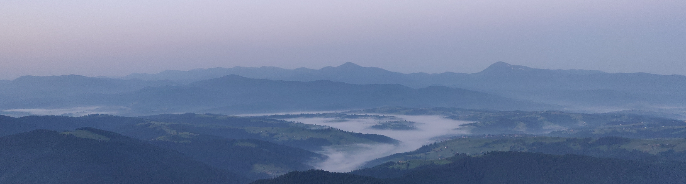

### Hi there, everybody!:wave:
#### I am a code guy:computer: who likes to make things work:hammer:, nice to see you dropped by.

I have 6 years of experience in IT, most of them as an Automation QA:mag:. \
Now I'm passionate to work as a **web developer** :globe_with_meridians:.
---
####Skills:
- TypeScript/JavaScript (~4 years experience);
- React/Redux;
- HTML/CSS (SASS);
- Mocha/Jasmine/Jest;
- Git/SVN;
- SQL (MySQL/MSSQL 2012);
- Docker;

---
####Some statistics:
 

---
**Get in touch:** 

